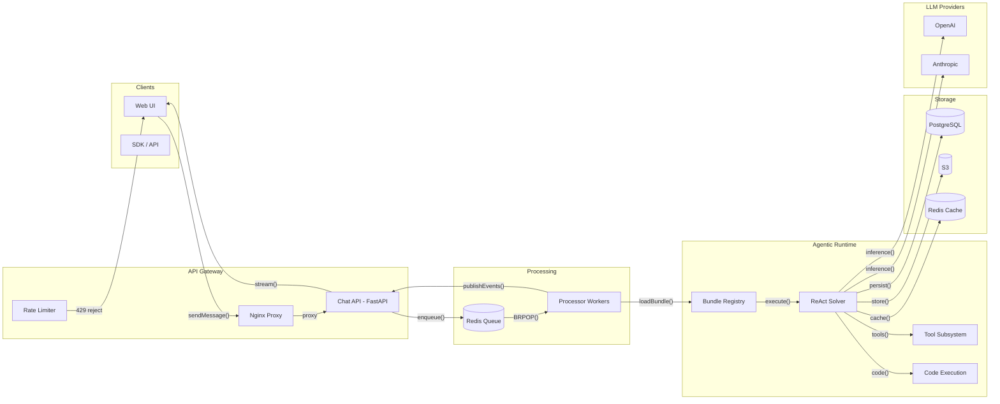
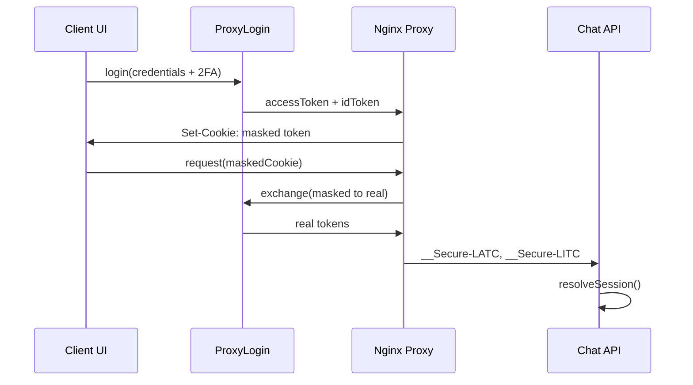

# /system-design — Generate System Architecture Diagrams

Generate architecture diagrams for a software system. Supports two output modes:

- **Mode A: HTML page** — Self-contained `.html` file with inline SVG diagrams, CSS, and JS
- **Mode B: FigJam** — Interactive diagrams in Figma's FigJam whiteboard via Figma MCP

Ask the user which mode they want. Default to HTML if unclear.

---

## INPUT

Before generating, you MUST gather:

1. **Architecture docs** — Read all available architecture/design docs in the project (READMEs, arch docs, design docs). Understand the system end-to-end.
2. **Output mode** — HTML page or FigJam (requires Figma MCP connection).
3. **System name** — The product/project name.
4. **Target file** — (HTML mode only) Ask or default to `architecture.html` at project root.

---

# MODE A: HTML PAGE

## OUTPUT STRUCTURE

The page follows a **sectioned deep-dive** format inspired by system design interview breakdowns (HelloInterview style). Each section has: label, title, description, SVG diagram, and optional flow-step cards / data-model cards / info boxes.

### Page skeleton

```
Header          — dark bg, system name + subtitle
Sticky Nav      — section links, highlight on scroll
Section 1       — System Overview (the main diagram)
Section 2..N    — Deep Dives (auth, streaming, storage, etc.)
Footer          — system name + source docs
```

### Typical sections (adapt to the system)

| # | Section | What it shows |
|---|---------|---------------|
| 1 | **System Overview** | End-to-end flow: clients → gateway → processing → storage. The "hero" diagram. |
| 2 | **Auth Flow** | Sequence diagram style: token exchange, cookie flow, session resolution. |
| 3 | **Streaming / Transport** | How events flow from workers back to clients (relay, pub/sub, fan-out). |
| 4 | **Core Runtime / Engine** | Internal architecture: solvers, tools, plugins, execution. |
| 5 | **Storage & Data Model** | Multi-tenant layout, schemas, data model cards. |
| 6 | **Economics / Rate Limiting** | Request pipeline: gateway check → economics check → execute → track. |
| 7 | **Scaling** | Horizontal scaling: stateless instances, shared queues, load tracking. |

## VISUAL STYLE

### Fonts
- **Body text**: `Inter` (Google Fonts) — weights 400, 500, 600, 700
- **Code / arrow labels**: `JetBrains Mono` (Google Fonts) — weights 400, 500
- Load via: `https://fonts.googleapis.com/css2?family=Inter:wght@400;500;600;700&family=JetBrains+Mono:wght@400;500&display=swap`

### Color palette (CSS custom properties)

```css
:root {
  --blue-50: #eff6ff; --blue-100: #dbeafe; --blue-200: #bfdbfe;
  --blue-500: #3b82f6; --blue-600: #2563eb; --blue-700: #1d4ed8;
  --green-50: #f0fdf4; --green-100: #dcfce7; --green-500: #22c55e; --green-600: #16a34a;
  --orange-50: #fff7ed; --orange-100: #ffedd5; --orange-500: #f97316; --orange-600: #ea580c;
  --purple-50: #faf5ff; --purple-100: #f3e8ff; --purple-500: #a855f7; --purple-600: #9333ea;
  --red-50: #fef2f2; --red-100: #fee2e2; --red-500: #ef4444; --red-600: #dc2626;
  --teal-50: #f0fdfa; --teal-500: #14b8a6; --teal-600: #0d9488;
  --yellow-50: #fefce8; --yellow-100: #fef9c3; --yellow-500: #eab308;
  --gray-50: #f9fafb; --gray-100: #f3f4f6; --gray-200: #e5e7eb; --gray-300: #d1d5db;
  --gray-400: #9ca3af; --gray-500: #6b7280; --gray-600: #4b5563; --gray-700: #374151;
  --gray-800: #1f2937; --gray-900: #111827;
}
```

### Color assignment convention

| Role | Fill | Stroke | Use for |
|------|------|--------|---------|
| **Core API / compute** | `--blue-50` | `--blue-600` | API gateways, web servers, proxy |
| **Queue / cache (Redis)** | `--red-50` | `--red-500` | Redis queues, relay, pub/sub |
| **Workflows / plugins** | `--orange-50` | `--orange-500` | Bundles, workflows, S3 storage |
| **External providers** | `--green-50` | `--green-500` | LLM providers, search APIs |
| **Auth / control plane** | `--purple-50` | `--purple-500` | Auth services, policies, economics control |
| **Knowledge / integrations** | `--teal-50` | `--teal-500` | KB, optional services (Neo4j) |
| **Attention / warnings** | `--yellow-50` | `--yellow-500` | Solvers, planning, PK badges |
| **Neutral / infrastructure** | `--gray-50` | `--gray-400` | Load balancers, generic arrows |

### Layout rules

- **Max container width**: 1100px, centered, 32px horizontal padding.
- **Diagram wrap**: light gray bg (`--gray-50`), 1px border (`--gray-200`), 12px border-radius, 40px padding. `overflow-x: auto` for mobile.
- **White background** for the page body.
- **Sticky nav** at top, highlight active section via IntersectionObserver.

## SVG DIAGRAM RULES

All diagrams are **inline SVG** (no external deps, no canvas, no Rough.js). This ensures crisp rendering, easy editing, and zero load failures.

### SVG element library

#### Service box (rounded rect)
```svg
<rect x="X" y="Y" width="W" height="H" rx="8" ry="8" fill="FILL" stroke="STROKE" stroke-width="1.5"/>
<text x="CX" y="TY" font-size="13" font-weight="600" fill="STROKE" text-anchor="middle" dominant-baseline="central" font-family="Inter, sans-serif">TITLE</text>
<text x="CX" y="SY" font-size="10" fill="#9ca3af" text-anchor="middle" dominant-baseline="central" font-family="Inter, sans-serif">SUBTITLE</text>
```

#### Database cylinder
```svg
<ellipse cx="CX" cy="TOP" rx="40" ry="9" fill="FILL" stroke="STROKE" stroke-width="1.5"/>
<rect x="CX-40" y="TOP" width="80" height="30" fill="FILL" stroke="none"/>
<line x1="CX-40" y1="TOP" x2="CX-40" y2="TOP+30" stroke="STROKE" stroke-width="1.5"/>
<line x1="CX+40" y1="TOP" x2="CX+40" y2="TOP+30" stroke="STROKE" stroke-width="1.5"/>
<ellipse cx="CX" cy="TOP+30" rx="40" ry="9" fill="FILL" stroke="STROKE" stroke-width="1.5"/>
<text x="CX" y="TOP+20" font-size="11" font-weight="600" fill="STROKE" text-anchor="middle" font-family="Inter, sans-serif">LABEL</text>
```

#### Arrow line
```svg
<line x1="X1" y1="Y1" x2="X2" y2="Y2" fill="none" stroke="COLOR" stroke-width="1.5" marker-end="url(#arrowhead)"/>
<text x="MX" y="MY-6" font-size="11" fill="COLOR" font-family="JetBrains Mono, monospace" text-anchor="middle">LABEL</text>
```

#### Step number circle
```svg
<circle cx="CX" cy="CY" r="10" fill="#2563eb"/>
<text x="CX" y="CY" font-size="11" font-weight="700" fill="#fff" text-anchor="middle" dominant-baseline="central">N</text>
```

#### Badge pill (inside a service box)
```svg
<rect x="X" y="Y" width="W" height="14" rx="3" fill="LIGHT_FILL"/>
<text x="CX" y="CY" font-size="9" font-weight="500" fill="STROKE" text-anchor="middle">LABEL</text>
```

#### Dashed group boundary
```svg
<rect x="X" y="Y" width="W" height="H" rx="10" fill="none" stroke="#d1d5db" stroke-dasharray="6 4"/>
<text x="TX" y="TY" font-size="11" font-weight="600" text-transform="uppercase" letter-spacing="0.8" fill="#6b7280">GROUP LABEL</text>
```

#### Optional/dashed service
Use `stroke-dasharray="4 3"` on the rect/ellipse to indicate optional components.

### SVG arrowhead defs (place once, hidden)

```svg
<svg style="position:absolute;width:0;height:0;">
  <defs>
    <marker id="arrowhead" markerWidth="10" markerHeight="7" refX="9" refY="3.5" orient="auto">
      <polygon points="0 0, 10 3.5, 0 7" fill="#9ca3af"/>
    </marker>
    <marker id="arrowhead-blue" markerWidth="10" markerHeight="7" refX="9" refY="3.5" orient="auto">
      <polygon points="0 0, 10 3.5, 0 7" fill="#3b82f6"/>
    </marker>
    <!-- Repeat for each color: -green (#22c55e), -orange (#f97316), -red (#ef4444), -purple (#a855f7) -->
  </defs>
</svg>
```

### Layout strategy — AVOIDING OVERLAPS

This is the most critical part. Follow these rules strictly:

1. **Row-based layout**: Arrange nodes in horizontal rows. Each row has a consistent `y` range. Leave at least 50px vertical gap between rows.
2. **No diagonal arrows across rows**: When an arrow must span multiple rows, route it as an **L-shape** (horizontal segment + vertical segment) through a gutter column (left or right edge of the diagram).
3. **Return paths go through gutters**: If the data flow is circular (forward + return), use the **left gutter** (x=30-80) or **right gutter** for the return path. Never route return arrows through the center where they'd cross forward-path nodes.
4. **Storage column on the side**: Place databases/storage in a dedicated column (typically right side), inside a dashed group boundary. Connect with short horizontal arrows from the nearest row, not diagonal arrows from distant nodes.
5. **SVG viewBox sizing**: Set the viewBox width to fit all content with 20px margin. Typical widths: 880-1060px. Height varies by content. Never exceed 1060px width to avoid horizontal scroll in the 1100px container.
6. **Arrow label placement**: Place labels ABOVE horizontal arrows, to the RIGHT of vertical arrows. For L-shaped arrows, place the label at the corner point.
7. **Minimum spacing**: 40px gap between adjacent boxes horizontally, 50px vertically. Arrow labels need 20px clearance from any box edge.

### Diagram complexity targets

| Diagram type | Max nodes | Notes |
|---|---|---|
| Overview | 8-12 | Main pipeline + storage + external providers |
| Sequence (auth) | 4-6 participants | Lifelines + numbered step arrows |
| Subsystem | 6-10 | One subsystem in detail |
| Data layout | 4-8 | Boxes-in-boxes for multi-tenancy |
| Pipeline | 4-6 | Linear flow with step numbers |

## HTML COMPONENTS

### Flow step cards (below diagram)

```html
<div class="flow-steps">
  <div class="flow-step">
    <div class="step-num">1</div>
    <div class="step-text">
      <h4>Step Title</h4>
      <p>Description of what happens at this step.</p>
    </div>
  </div>
  <!-- repeat -->
</div>
```

### Data model cards

```html
<div class="data-models">
  <div class="data-model">
    <div class="data-model-header COLOR_CLASS">Store Name</div>
    <div class="data-model-body">
      <div class="field">
        <span class="fname">field_name</span>
        <span><span class="fpk">PK</span> <span class="ftype">TYPE</span></span>
      </div>
      <!-- repeat -->
    </div>
  </div>
</div>
```

Color classes for headers: `.pg` (blue-600), `.redis` (red-500), `.s3` (orange-500), `.neo4j` (teal-500).

### Info box

```html
<div class="info-box blue|green|orange">
  <div class="icon">EMOJI</div>
  <div><strong>Key insight title:</strong> Explanation text.</div>
</div>
```

### Legend

```html
<div class="legend">
  <div class="legend-item"><div class="legend-swatch" style="background:COLOR"></div> Label</div>
</div>
```

## HTML GENERATION PROCESS

1. **Read** all architecture/design docs in the project.
2. **Identify** the major subsystems, data flows, storage backends, and external integrations.
3. **Plan sections** — decide which deep dives are relevant (not every system needs all 7).
4. **Draft each SVG** on paper (mentally): place nodes in rows, plan arrow routing, check for overlaps.
5. **Write the HTML** — all inline, single file, no external dependencies except Google Fonts.
6. **Verify** — open in browser, screenshot, check for overlaps or text clipping.

## HTML CHECKLIST

- [ ] Single self-contained HTML file (no external JS/CSS except Google Fonts)
- [ ] All SVG diagrams render without overlaps or clipping
- [ ] Sticky nav highlights correctly on scroll
- [ ] Smooth scroll on nav click
- [ ] Color coding is consistent across all diagrams
- [ ] Arrow labels don't overlap nodes
- [ ] Mobile: diagrams scroll horizontally, text reflows
- [ ] Footer references source docs

## REFERENCE IMPLEMENTATION

See `architecture_ver1.html` in the project root for a complete HTML example targeting the KDCube AI App system. It demonstrates all components: header, nav, 7 sections with SVG diagrams, flow steps, data models, info boxes, and the navigation script.

---

# MODE B: FIGJAM DIAGRAMS

Generate diagrams in Figma's FigJam whiteboard using the Figma MCP `generate_diagram` tool. This creates editable, collaborative diagrams directly in Figma.

## PREREQUISITES

- Figma MCP plugin must be connected (check with `/mcp` — should show `plugin:figma:figma: connected`)
- If status is `needs-auth`, user must authenticate via OAuth first

## TOOL

Use `generate_diagram` with Mermaid.js syntax:

```
generate_diagram(
  name: "Diagram Title",
  userIntent: "What the diagram shows",
  mermaidSyntax: "flowchart LR ..."
)
```

The tool returns a FigJam URL that the user can open to view and edit the diagram.

## SUPPORTED DIAGRAM TYPES

| Type | Mermaid keyword | Best for |
|------|----------------|----------|
| **Flowchart** | `flowchart LR` or `flowchart TD` | System architecture, request flows, pipelines |
| **Sequence diagram** | `sequenceDiagram` | Auth flows, API call chains, message passing |
| **State diagram** | `stateDiagram-v2` | Lifecycle states, connection states, task states |
| **Gantt chart** | `gantt` | Timelines, project phases, migration plans |

## FIGJAM MERMAID RULES

Follow these rules strictly when writing Mermaid syntax for `generate_diagram`:

1. **Put ALL text in double quotes** — node labels, edge labels, subgraph titles:
   ```
   A["Web Client"] -->|"sendMessage()"| B["API Gateway"]
   ```
2. **No emojis** in the Mermaid code.
3. **No `\n`** for line breaks — Mermaid in FigJam does not support them.
4. **Use `LR` (left-to-right) by default** for architecture diagrams. Use `TD` (top-down) only for deep hierarchies or state machines.
5. **Subgraphs for grouping** — group related services:
   ```
   subgraph Storage["Storage Layer"]
     S[("PostgreSQL")]
     T[("Redis")]
     U[("S3")]
   end
   ```
6. **Node shape conventions**:
   - `["text"]` — rectangle (services, APIs, workers)
   - `[("text")]` — cylinder (databases, storage)
   - `{"text"}` — diamond (decisions, checks)
   - `(["text"])` — stadium/pill (queues, buffers)
   - `(("text"))` — circle (clients, external)
7. **Arrow label style** — use function-name style: `"sendMessage()"`, `"enqueue()"`, `"BRPOP()"`, `"inference()"`, `"persist()"`.
8. **Keep it readable** — max ~15-20 nodes per diagram. For complex systems, generate multiple focused diagrams rather than one giant one.

## DIAGRAM GENERATION STRATEGY

For a full system architecture, generate **multiple FigJam diagrams** (one per concern):

| Diagram | Type | Content |
|---------|------|---------|
| **System Overview** | `flowchart LR` | End-to-end: clients → gateway → queue → workers → storage. Subgraphs for major layers. |
| **Request Flow** | `flowchart LR` | Focused linear pipeline with decision diamonds for auth/rate-limit checks. |
| **Auth Flow** | `sequenceDiagram` | Participants: Client, ProxyLogin, Nginx, API. Messages for token exchange. |
| **Data Flow** | `flowchart LR` | How data moves between storage systems (PG, Redis, S3, Neo4j). |
| **Scaling** | `flowchart LR` | Load balancer → N API instances → Redis → N workers. |

## EXAMPLE: SYSTEM OVERVIEW FLOWCHART



## EXAMPLE: AUTH SEQUENCE DIAGRAM



## FIGJAM GENERATION PROCESS

1. **Read** all architecture/design docs in the project.
2. **Identify** the major subsystems and decide which diagrams to generate.
3. **Generate each diagram** with `generate_diagram` — one tool call per diagram.
4. **Return all URLs** as clickable markdown links so the user can open them in FigJam.
5. **Suggest edits** — tell the user they can drag nodes, recolor, and add annotations in FigJam.

## FIGJAM CHECKLIST

- [ ] All node labels are in double quotes
- [ ] Arrow labels use function-name style
- [ ] No emojis in Mermaid code
- [ ] Max 15-20 nodes per diagram (split if larger)
- [ ] Subgraphs used to group related components
- [ ] Each diagram URL returned as a clickable markdown link
- [ ] Used correct Mermaid shapes (cylinders for DBs, diamonds for decisions)

---

# CONTENT GUIDELINES (both modes)

- **Titles**: Short, noun-based ("System Overview", "Auth Flow", not "How Authentication Works").
- **Descriptions**: 1-2 sentences max. State what the section shows, not how the system works.
- **Arrow labels**: Use function-name style where possible: `enqueue()`, `fanOut()`, `stream()`, `inference()`. For simple connections use nouns: `HTTPS`, `tokens`, `events`.
- **Step descriptions**: Start with a verb. "Gateway validates auth..." not "The gateway validates auth...".
- **Info boxes** (HTML mode): One key insight per section max. Blue = security/architecture, Green = performance/design, Orange = operations/scaling.
- **Diagram focus**: Each diagram should tell ONE story. Don't cram everything into a single diagram.
